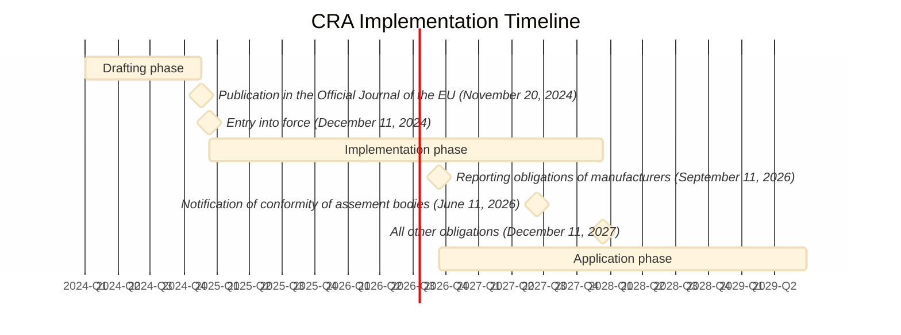

# CRA FAQ

## The Cyber Resilience Act (CRA) itself

#### Q: What is the Cyber Resilience Act (CRA)?

The Cyber Resilience Act (CRA) is a new EU Regulation that aims to safeguard consumers and businesses who use software or products with digital components. It creates mandatory cybersecurity requirements for manufacturers and retailers that extend throughout the product lifecycle and the whole software supply chain (including all open source dependencies and transitive dependencies) and helps consumers and business identify such products through the CE mark.

#### Q: Where is the official text of the CRA?

The final text of the CRA can be found on [EUR-Lex][CRA] ([English HTML version][CRA HTML]).

#### Q: When does the CRA enter into force and when does the regulation start to apply?

The CRA enters into force on December 11, 2024. Reporting obligations of manufacturers ([Article 14][]) start to apply on September 11, 2026.
The notification of conformity of assement bodies ([Chapter IV][]) start to apply on June 11, 2026. Everything else starts to apply on December 11, 2027.

#### Q: What is in scope of the CRA?

The following types of product are in scope of the CRA:

- Hardware products (e.g. laptops, smart appliances, mobile phones, network equipment, CPUs, etc.)
- Software products (e.g. operating systems, word processing, games or mobile apps, software libraries, etc.)
- Remote data processing solutions for any of the above, as far as they are necessary for a product to perform its functions (e.g. cloud-based services that allow control of a smart lock at a distance, remote database that backs-up user preferences, etc.)

#### Q: What is NOT in scope of the CRA?

The following types of product are NOT in scope of the CRA:

- Products already covered by other regulations or directives: civil aviation equipment ([2018/1139][]), marine equipment ([2014/90][]), medical devices ([2017/745][] and [2017/746][]), motor vehicles ([2019/2144][]), and software as a service (SaaS) ([NIS 2][])
- Products exclusively designed for national security or defence purposes
- Products specifically designed to process classified information

_It is worth noting however, that the intent of the EU legislators is to harmonize the various regulations mentioned above with the CRA in the near future._

## Open source projects

#### Q: What criteria determine whether an open source project is in scope of the CRA?

#### Q: Is distributing binaries or container images of an open source project considered as making it available on the market?

No. Monetization by the original manufacturer is what determines whether a product is made available on the market. As per [Recital 18][], merely supplying open source components isn't indicative of a commercial activity:

> Furthermore, the supply of products with digital elements qualifying as free and open-source software components intended for integration by other manufacturers into their own products with digital elements should be considered to be making available on the market only if the component is monetised by its original manufacturer. […] In addition, the mere presence of regular releases should not in itself lead to the conclusion that a product with digital elements is supplied in the course of a commercial activity.

## Maintainers

#### Q: Am I subject to the CRA if I only contribute to an open source project?

No. Contributions to an open source project are explicitely not in scope of the CRA. See [Recital 18][]: 

> This Regulation does not apply to natural or legal persons who contribute with source code to products with digital elements qualifying as free and open-source software that are not under their responsibility.

## Open-Source Software Stewards

#### Q: What is an _open-source software steward_?

_Open-source software steward_ is a term defined in [Article 3(14)][] of the CRA. It describes an organization which supports open source software but isn't itself a commercial actor (e.g. an open source foundation):

> ‘open-source software steward’ means a legal person, other than a manufacturer, that has the purpose or objective of systematically providing support on a sustained basis for the development of specific products with digital elements, qualifying as free and open-source software and intended for commercial activities, and that ensures the viability of those products;

_Open-source software steward_ are subject to a "light-touch and tailor-made regulatory regime" ([Recital 19][]), defined in [Article 24][].

#### Q: Can an solo maintainer be considered to be an _open-source software steward_?

No. As defined in [Article 3(14)][], an _open-source software steward_ must be a _legal person_ (e.g. a company, an organization, etc.) in contrast with a _natural person_ (i.e. a human being). The obligations of _open-source software stewards_ described in [Article 24][] therefore do not apply to solo maintainers. It is worth noting however, that _natural persons_ are subject to the same obligations as _legal persons_ would be should they monetize their poject.

#### Q: Can a loosely organized group of maintainers be considered to be an _open-source software steward_?

In [Article 3(14)][], the CRA defines _open-source software steward_ as a _legal person_ which whould exempt loosely organized groups of maintainers from the obligations of _open-source software stewards_. However, in certain European jurisdictions, groups of people acting in concert have been considered as a _legal person_ in certain cases, even though their relationship wasn't formalized by creating an organization of any kind. So it is possible that in some cases, a loosely organized group of maintainers might be considered as an _open-source software steward_ and therefore be subject to the obligations described in [Article 24][]. It is worth noting that not complying to those obligations doesn't carry penalties as per [Article 64(10)(b)][].

## Manufacturers

#### Q: What is a _manufacturer_?

The term _Manufacturer_ is defined in [Article 3(13)][] of the CRA:
	
> ‘manufacturer’ means a natural or legal person who develops or manufactures products with digital elements or has products with digital elements designed, developed or manufactured, and markets them under its name or trademark, whether for payment, monetisation or free of charge;

#### Q: Can a _manufacturer_ also be an _open-source software steward_?

Yes, a _manufacturer_ can also be an _open-source software steward_, but it cannot be both the _manufacturer_ and _open-source software steward_ of the same project.

## EU Legislation

#### Q: What is the _Blue Guide_?

The [Blue Guide][] is one of the main reference documents of the European Commission explaining how to implement legislation based on the New Legislative Framework (NLF). Unlike the CRA, the Blue Guide does not have legal force. It predates the CRA and only discusses software as something embedded into a physical product, not as standalone.
For this reason, until an updated version is available, the Blue Guide's guidance should be read in light of the CRA's wider scope and take into account the nuances introduced in the CRA for software. For example, on the concept of "commercial activity", [Recital 18][] CRA provides more specific guidance on "monetisation" and "non-profit organisations" than is available in the Blue Guide's "Making available on the market" section.

#### Q: What is the _New Legislative Framework_ (NLF)?

#### Q: What is a _Harmonized Standard_ and why does it matter?

#### Q: What is a _legal person_?

[CRA]: https://eur-lex.europa.eu/eli/reg/2024/2847/oj
[CRA HTML]: https://eur-lex.europa.eu/legal-content/EN/TXT/HTML/?uri=OJ:L_202402847
[Recital 18]: https://eur-lex.europa.eu/legal-content/EN/TXT/HTML/?uri=OJ:L_202402847#rct_18
[Recital 19]: https://eur-lex.europa.eu/legal-content/EN/TXT/HTML/?uri=OJ:L_202402847#rct_19
[Article 3(13)]: https://eur-lex.europa.eu/legal-content/EN/TXT/HTML/?uri=OJ:L_202402847#art_3
[Article 3(14)]: https://eur-lex.europa.eu/legal-content/EN/TXT/HTML/?uri=OJ:L_202402847#art_3
[Article 14]: https://eur-lex.europa.eu/legal-content/EN/TXT/HTML/?uri=OJ:L_202402847#art_14
[Article 24]: https://eur-lex.europa.eu/legal-content/EN/TXT/HTML/?uri=OJ:L_202402847#art_24
[Article 64(10)(b)]: https://eur-lex.europa.eu/legal-content/EN/TXT/HTML/?uri=OJ:L_202402847#art_64
[Chapter IV]: https://eur-lex.europa.eu/legal-content/EN/TXT/HTML/?uri=OJ:L_202402847#cpt_IV

[2014/90]: https://eur-lex.europa.eu/eli/dir/2014/90/oj
[2017/745]: https://eur-lex.europa.eu/eli/reg/2017/745/oj
[2017/746]: https://eur-lex.europa.eu/eli/reg/2017/746/oj
[2018/1139]: https://eur-lex.europa.eu/eli/reg/2018/1139/oj
[2019/2144]: https://eur-lex.europa.eu/eli/reg/2019/2144/oj
[NIS 2]: https://eur-lex.europa.eu/eli/dir/2022/2555/oj

[Blue Guide]: https://eur-lex.europa.eu/legal-content/EN/TXT/HTML/?uri=CELEX:52022XC0629(04)
