# CRA FAQ

## About this document

This document represents a community effort to collect and answer frequently asked questions about the Cyber Resilience Act (CRA) as it relates to open source. 

The purpose of this document is twofold:

1. to consolidate community understanding of the CRA, and
2. to outline areas of the CRA which remain unclear and would [benefit from guidance][] from the European Commission.

### Disclaimer

> [!WARNING]
> Nothing contained in this document constitutes legal advice. If you have any legal questions about the CRA, you should consult with an attorney.

### Document Status

This is a draft document and may be updated, replaced or obsoleted at any time. It is inappropriate to cite this document as other than a work in progress. Publication of this document as a draft does not imply endorsement by the Eclipse Foundation, Open Regulatory Working Group Members, or contributors.

### Issue tracker

Open issues, pull requests, and untriagged FAQs can be found on [GitHub](https://github.com/orcwg/cra-hub/labels/FAQ).

### Notation conventions

#### Questions which would benefit from European Commission guidance

Frequently asked questions which would benefit from guidance from the European Commission are indicated with the following callout:

**🛑 CAUTION:** Pending confirmation through European Commission Guidance that [REASON].

#### Maturity level of answers

The maturity level of the answers contained in this document are indicated using the following system:

| Maturity level status | Icon | Description |
| :-------------------- |:----:| :---------- |
| No answer yet         |   ❓  | No answer has been drafted yet. |
| Draft                 |   ⚠️  | Hasn't been reviewed by SIG. Answer may be incomplete or incorrect. |
| Pending Review        |   👀  | Ready to be reviewed by the SIG. |
| Pending Guidance      |   🛑  | Identified by the SIG as requiring input from the EU Commission. |
| Approved              |   ✅  | Has been reviewed by the SIG. Represents community best effort to provide an actionable answer. |

Maturity level statuses are assigned using the process described in [Annex 1](#annex-1) below.


## Frequently Asked Questions about the Cyber Resilience Act (CRA)

### The Cyber Resilience Act (CRA) itself

<details>
    <a name="q-what-is-the-cyber-resilience-act-cra"></a>
    <summary><strong><a name="faq-tmp-154" href="#faq-tmp-154">tmp-154.</a> What is the Cyber Resilience Act (CRA)?</strong></summary>

The Cyber Resilience Act (CRA) is a new EU Regulation that aims to safeguard consumers and businesses who use software or products with digital components. It creates mandatory cybersecurity requirements for manufacturers and retailers that extend throughout the product lifecycle and the whole software supply chain (including all open source dependencies and transitive dependencies) and helps consumers and business identify such products through the [CE mark](https://en.wikipedia.org/wiki/CE_marking).

> Status: ⚠️ [Draft][]
| GitHub issue(s): [#154](https://github.com/orcwg/cra-hub/issues/154)
</details>

<details>
    <a name="q-where-is-the-official-text-of-the-cra"></a>
    <summary><strong><a name="faq-tmp-155" href="#faq-tmp-155">tmp-155.</a> Where is the official text of the CRA?</strong></summary>

The final text of the CRA can be found on [EUR-Lex][CRA] ([English HTML version][CRA HTML]).

> Status: ⚠️ [Draft][]
| GitHub issue(s): [#155](https://github.com/orcwg/cra-hub/issues/155)
</details>


<details>
    <a name="q-when-does-the-cra-enter-into-force-and-when-does-the-regulation-start-to-apply"></a>
    <summary><strong><a name="faq-tmp-10" href="#faq-tmp-10">tmp-10.</a> When does the CRA enter into force and when does the regulation start to apply?</strong></summary>

The CRA enters into force on December 11, 2024 ([Article 71][]). The notification of conformity of assessment bodies ([Chapter IV][]) start to apply on June 11, 2026. Reporting obligations of manufacturers ([Article 14][]) and stewards ([Article 24][]) start to apply on September 11, 2026. Everything else starts to apply on December 11, 2027.


> Status: ⚠️ [Draft][]
| GitHub issue(s): [#10](https://github.com/orcwg/cra-hub/issues/10)
</details>

<details>
    <a name="q-what-is-in-scope-of-the-cra"></a>
    <summary><strong><a name="faq-tmp-2" href="#faq-tmp-2">tmp-2.</a> What kinds of products are regulated by the CRA?</strong></summary>

The following types of product are "in scope" (i.e., their design and production may be regulated by) the CRA:

- Hardware products (e.g. laptops, smart appliances, mobile phones, network equipment, CPUs, etc.)
- Software products (e.g. operating systems, word processing, games or mobile apps, software libraries, etc.)
- Remote data processing solutions for any of the above, as far as those solutions are necessary for a product to perform its functions (e.g. cloud-based services that allow control of a smart lock at a distance, remote database that backs-up user preferences, etc.)

> Status: ⚠️ [Draft][]
| GitHub issue(s): [#2](https://github.com/orcwg/cra-hub/issues/2)
</details>


<details>
    <a name="q-what-is-not-in-scope-of-the-cra"></a>
    <summary><strong><a name="faq-tmp-156" href="#faq-tmp-156">tmp-156.</a> What is NOT in scope of the CRA?</strong></summary>

The following types of product are NOT in scope of the CRA:

- Products already covered by other regulations or directives: civil aviation equipment ([2018/1139][]), marine equipment ([2014/90][]), medical devices ([2017/745][] and [2017/746][]), motor vehicles ([2019/2144][]), and software as a service (SaaS) ([NIS 2][])
- Products exclusively designed for national security or defence purposes
- Products specifically designed to process classified information

_It is worth noting however, that the intent of the EU legislators is to harmonize the various regulations mentioned above with the CRA in the near future._

> Status: ⚠️ [Draft][]
| GitHub issue(s): [#156](https://github.com/orcwg/cra-hub/issues/156)
</details>


### Open source projects

<details>
    <a name="q-what-criteria-determine-whether-an-open-source-project-is-in-scope-of-the-cra"></a>
    <summary><strong><a name="faq-tmp-124" href="#faq-tmp-124">tmp-124.</a> What criteria determine whether an open source project is in scope of the CRA?</strong></summary>

> Status: ❓ [No answer yet][]
| GitHub issue(s): [#124](https://github.com/orcwg/cra-hub/issues/124)
</details>


<details>
    <a name="q-is-distributing-binaries-or-container-images-of-an-open-source-project-considered-as-making-it-available-on-the-market"></a>
    <summary><strong><a name="faq-tmp-157" href="#faq-tmp-157">tmp-157.</a> Is distributing binaries or container images of an open source project considered as making it available on the market?</strong></summary>

No. Monetization by the original manufacturer is what determines whether a product is made available on the market. As per [Recital 18][], merely supplying open source components isn't indicative of a commercial activity:

> Furthermore, the supply of products with digital elements qualifying as free and open-source software components intended for integration by other manufacturers into their own products with digital elements should be considered to be making available on the market only if the component is monetised by its original manufacturer. […] In addition, the mere presence of regular releases should not in itself lead to the conclusion that a product with digital elements is supplied in the course of a commercial activity.

> Status: ⚠️ [Draft][]
| GitHub issue(s): [#157](https://github.com/orcwg/cra-hub/issues/157)
</details>


### Maintainers

<details>
    <a name="q-am-i-subject-to-the-cra-if-i-only-contribute-to-an-open-source-project"></a>
    <summary><strong><a name="faq-tmp-17" href="#faq-tmp-17">tmp-17.</a> Am I subject to the CRA if I only contribute to an open source project?</strong></summary>

No. Contributions to an open source project are explicitely not in scope of the CRA. See [Recital 18][]: 

> This Regulation does not apply to natural or legal persons who contribute with source code to products with digital elements qualifying as free and open-source software that are not under their responsibility.

> Status: ⚠️ [Draft][]
| GitHub issue(s): [#17](https://github.com/orcwg/cra-hub/issues/17)
</details>


<details>
    <summary><strong><a name="faq-tmp-70" href="#faq-tmp-70">tmp-70.</a> I am NOT subject to the CRA, and want to make this clear to downstream users. What should I say?</strong></summary>
  
Reply to their requests, stating the following:
<code>
- On the basis of [Recital 18 of the Cyber Resilience Act](https://eur-lex.europa.eu/legal-content/EN/TXT/HTML/?uri=OJ:L_202402847#rct_18), I do not fall within the scope of the regulation, and cannot be considered as a Manufacturer or an Open source software steward under the Cyber Resilience Act.
- On the basis of [Recital 15 of the Product Liability Directive](https://eur-lex.europa.eu/legal-content/EN/TXT/HTML/?uri=OJ:L_202402853#rct_15), I cannot be held liable for your use of my code.
- **While I don't have obligations towards you, you may have some towards me:**
	- On the basis of [Article 13.6 the Cyber Resilience Act](https://eur-lex.europa.eu/legal-content/EN/TXT/HTML/?uri=OJ:L_202402847#art_13), if you believe you have found a security flaw in this code, you are responsible for reporting it by following the vulnerability disclosure process here: << project link >>. You are also responsible for fixing it within your product and providing the fix upstream.
</code>

> Status: ⚠️ [Draft][]
| GitHub issue(s): [#70](https://github.com/orcwg/cra-hub/issues/70)
</details>


<details>
    <a name="q-can-an-solo-maintainer-be-considered-to-be-an-open-source-software-steward"></a>
    <summary><strong><a name="faq-tmp-1" href="#faq-tmp-1">tmp-1.</a> Can an solo maintainer be considered to be an <em>open-source software steward</em>?</strong></summary>

No. As defined in [Article 3(14)][], an _open-source software steward_ must be a _legal person_ (e.g. a company, an organization, etc.) in contrast with a _natural person_ (i.e. a human being). The obligations of _open-source software stewards_ described in [Article 24][] therefore do not apply to solo maintainers. It is worth noting however, that _natural persons_ are subject to the same obligations as _legal persons_ would be should they monetize their poject.

**🛑 CAUTION:** Pending confirmation through European Commission Guidance that _legal persons_ do not include _natural persons_ in the context of the CRA.

> Status: ⚠️ [Draft][]
| GitHub issue(s): [#1](https://github.com/orcwg/cra-hub/issues/1)
</details>


<details>
    <a name="q-can-a-loosely-organized-group-of-maintainers-be-considered-to-be-an-open-source-software-steward"></a>
    <summary><strong><a name="faq-tmp-15" href="#faq-tmp-15">tmp-15.</a> Can a loosely organized group of maintainers be considered to be an <em>open-source software steward</em>?</strong></summary>

No. As defined in [Article 3(14)][], an _open-source software steward_ must be a _legal person_, which in the context of the CRA means an legal entity such as a business or nonprofit.

**🛑 CAUTION:** Pending confirmation through European Commission Guidance that _legal persons_ do not include _natural persons_ in the context of the CRA.

> Status: ⚠️ [Draft][]
| GitHub issue(s): [#15](https://github.com/orcwg/cra-hub/issues/15)
</details>


### Open-Source Software Stewards

<details>
    <a name="q-what-is-an-open-source-software-steward"></a>
    <summary><strong><a name="faq-tmp-127" href="#faq-tmp-127">tmp-127.</a> What is an <em>open-source software stewards</em>?</strong></summary>

_Open-source software steward_ is a term defined in [Article 3(14)][] of the CRA, to subject specific organisations to a subset of CRA obligations because they exist to support free and open source software that is intended for commercial activities (by others):

> ‘open-source software steward’ means a legal person, other than a manufacturer, that has the purpose or objective of systematically providing support on a sustained basis for the development of specific products with digital elements, qualifying as free and open-source software and intended for commercial activities, and that ensures the viability of those products;

[Recital 19][] states "Open-source software stewards include certain foundations as well as entities that develop and publish free and open-source software in a business context, including not-for-profit entities." At [FOSDEM 2024][FOSDEM24], the European Commission provided three examples of entities the co-legislators had in mind [^EC@FOSDEM24]:

  1. Foundations supporting specific FOSS projects
  2. Companies that build FOSS for their own use but make it public
  3. Not-for-profit entities that develop FOSS

> Status: ⚠️ [Draft][]
| GitHub issue(s): [#127](https://github.com/orcwg/cra-hub/issues/127)
</details>


<details>
    <a name="q-what-are-the-obligations-of-open-source-software-stewards"></a>
    <summary><strong><a name="faq-tmp-159" href="#faq-tmp-159">tmp-159.</a> What are the obligations of <em>open-source software stewards</em>?</strong></summary>

_Open-source software steward_ are subject to a "light-touch and tailor-made regulatory regime" ([Recital 19][]), defined in [Article 24][].

> Status: ⚠️ [Draft][]
| GitHub issue(s): [#159](https://github.com/orcwg/cra-hub/issues/159)
</details>

<details>
    <a name="q-how-do-open-source-software-stewards-demonstrate-that-they-meet-their-obligations"></a>
    <summary><strong><a name="faq-tmp-11" href="#faq-tmp-11">tmp-11.</a> How do <em>open-source software stewards</em> demonstrate that they meet their obligations?</strong></summary>

> Status: ❓ [No answer yet][]
| GitHub issue(s): [#11](https://github.com/orcwg/cra-hub/issues/11)
</details>


<details>
    <a name="q-what-happens-when-an-open-source-software-steward-doesnt-meet-its-obligations"></a>
    <summary><strong><a name="faq-tmp-158" href="#faq-tmp-158">tmp-158.</a> What happens when an <em>open-source software steward</em> doesn't meet its obligations?</strong></summary>

> Status: ❓ [No answer yet][]
| GitHub issue(s): [#158](https://github.com/orcwg/cra-hub/issues/158)
</details>


### Manufacturers

<details>
    <a name="q-what-is-a-manufacturer"></a>
	<summary><strong><a name="faq-tmp-59" href="#faq-tmp-59">tmp-59.</a> What is a <em>manufacturer</em>?</strong></summary>

The term _Manufacturer_ is defined in [Article 3(13)][] of the CRA:
	
> ‘manufacturer’ means a natural or legal person who develops or manufactures products with digital elements or has products with digital elements designed, developed or manufactured, and markets them under its name or trademark, whether for payment, monetisation or free of charge;

> Status: ⚠️ [Draft][]
| GitHub issue(s): [#59](https://github.com/orcwg/cra-hub/issues/59)
</details>


<details>
	<a name="q-can-a-manufacturer-also-be-an-open-source-software-steward"></a>
	<summary><strong><a name="faq-tmp-30" href="#faq-tmp-30">tmp-30.</a> Can a <em>manufacturer</em> also be an <em>open-source software steward</em>?</strong></summary>

Yes, a _manufacturer_ can also be an _open-source software steward_, but it cannot be both the _manufacturer_ and _open-source software steward_ of the same project.

> Status: ⚠️ [Draft][]
| GitHub issue(s): [#30](https://github.com/orcwg/cra-hub/issues/30)
</details>


### Standards

<details>
    <a name="q-what-is-a-harmonized-standard-and-why-does-it-matter"></a>
    <summary><strong><a name="faq-tmp-56" href="#faq-tmp-56">tmp-56.</a> What is a <em>harmonised standard</em> and why does it matter?</strong></summary>	

A _harmonised standard_ is a standard developed by the [European Standardisation Organisations (ESOs)][ESO]. It takes the legal requirements of the law and translates them into technical requirements for those implementing it. Certain _harmonised standards_ provide organisations which implement them with a _presumption of conformity_ with the law. This is why it is expected that most organisations will choose to implement the _harmonised standards_ to comply with the CRA. The ORC WG maintains a [list of _harmonised standards_][standards] requested by the European Commission to the ESOs.
  
> Status: ⚠️ [Draft][]
| GitHub issue(s): [#56](https://github.com/orcwg/cra-hub/issues/56)
</details>

### Important and Critical Product Categories

### EU Legislation

<details>
	<a name="q-what-is-the-blue-guide"></a>
	<summary><strong><a name="faq-tmp-4" href="#faq-tmp-4">tmp-4.</a> What is the <em>Blue Guide</em>?</strong></summary>

The [Blue Guide][] is one of the main reference documents of the European Commission explaining how to implement legislation based on the New Legislative Framework (NLF). Unlike the CRA, the Blue Guide does not have legal force. It predates the CRA and only discusses software as something embedded into a physical product, not as standalone.
For this reason, until an updated version is available, the Blue Guide's guidance should be read in light of the CRA's wider scope and take into account the nuances introduced in the CRA for software. For example, on the concept of "commercial activity", [Recital 18][] CRA provides more specific guidance on "monetisation" and "non-profit organisations" than is available in the Blue Guide's "Making available on the market" section.

> Status: ⚠️ [Draft][]
| GitHub issue(s): [#4](https://github.com/orcwg/cra-hub/issues/4)
</details>


<details>
    <a name="q-what-is-the-new-legislative-framework-nlf"></a>
    <summary><strong><a name="faq-tmp-57" href="#faq-tmp-57">tmp-57.</a> What is the <em>New Legislative Framework</em> (NLF)?</strong></summary>	

> Status: ❓ [No answer yet][]
| GitHub issue(s): [#56](https://github.com/orcwg/cra-hub/issues/56)
</details>


<details>
	<a name="q-what-is-a-legal-person"></a>
	<summary><strong><a name="faq-tmp-55" href="#faq-tmp-55">tmp-55.</a> What is a <em>legal person</em>?</strong></summary>

In the context of the CRA, a _legal person_ means an legal entity such as a business or nonprofit.

**🛑 CAUTION:** Pending confirmation through European Commission Guidance that _legal persons_ do not include _natural persons_ in the context of the CRA.

> Status: ⚠️ [Draft][]
| GitHub issue(s): [#55](https://github.com/orcwg/cra-hub/issues/55)
</details>

<details>
    <a name="q-what-is-a-security-attestation-in-the-cra"></a>
    <summary><strong><a name="faq-tmp-72" href="#faq-tmp-72">tmp-72.</a> What is a <em>security attestation</em> in the CRA?</strong></summary>

Security attestations in the CRA are an optional extension that do not exist yet. They may exist in the future, should the European Commission choose to establish them, with a legislative process called a "delegated act". Until such time, any resemblence with concepts elsewhere by the name of "attestation" is coincidental and should not restrict their future design in the CRA. For example, the "Secure Software Development Attestation" as a concept in the US is unrelated to the CRA.

> Status: ⚠️ [Draft][]
| GitHub issue(s): [#72](https://github.com/orcwg/cra-hub/issues/72)
</details>

## Annexes

### Annex 1 - Maturity level process

<a name="annex-1"></a>
Maturity level statuses are assigned using the following process. All answers start with a maturity level status of "No answer yet".

```mermaid
flowchart TD
    start[Status: No answer yet ❓]
    A[Status: Draft ⚠️]
    B[Status: Pending Review 👀]
    C[Status: Approved ✅]
    D[Status: Pending Guidance 🛑]
    start -- Add draft answer --> A
    A -- Ready for review --> B
    B --> SIG{"Passes SIG Review?"}
    SIG -- YES --> Q{"Requires EU guidance?"}
    SIG -- NO --> A
    Q -- NO --> C
    Q -- YES --> D
    D -- Guidance received --> SIG
```



### Annex 2 - FAQ formats

#### Draft FAQ format

```md
<details>
    <a name="PREVIOUS_ANCHOR_SO_WE_DONT_BREAK_EXTERNAL_REFERENCES"></a>
    <summary><strong><a name="faq-tmp-GITHUB_ISSUE_ID" href="#faq-tmp-GITHUB_ISSUE_ID">tmp-GITHUB_ISSUE_ID.</a> QUESTION</strong></summary>

ANSWER

> Status: ICON [MATURITY_LEVEL][]
| GitHub issue(s): [#GITHUB_ISSUE_ID](https://github.com/orcwg/cra-hub/issues/GITHUB_ISSUE_ID)
</details>
```

#### Final FAQ format

```md
<details>
    <a name="PREVIOUS_ANCHOR_SO_WE_DONT_BREAK_EXTERNAL_REFERENCES"></a>
    <a name="faq-tmp-GITHUB_ISSUE_ID"></a>
    <summary><strong><a name="faq-FINAL_ID" href="#faq-FINAL_ID">FINAL_ID.</a> QUESTION</strong></summary>

ANSWER

</details>
```

[benefit from guidance]: #questions-which-would-benefit-from-european-commission-guidance
[No answer yet]: #maturity-level-of-answers
[Draft]: #maturity-level-of-answers
[Pending review]: #maturity-level-of-answers
[Pending guidance]: #maturity-level-of-answers
[Approved]: #maturity-level-of-answers

[CRA]: https://eur-lex.europa.eu/eli/reg/2024/2847/oj
[CRA HTML]: https://eur-lex.europa.eu/legal-content/EN/TXT/HTML/?uri=OJ:L_202402847
[Recital 18]: https://eur-lex.europa.eu/legal-content/EN/TXT/HTML/?uri=OJ:L_202402847#rct_18
[Recital 19]: https://eur-lex.europa.eu/legal-content/EN/TXT/HTML/?uri=OJ:L_202402847#rct_19
[Article 3(13)]: https://eur-lex.europa.eu/legal-content/EN/TXT/HTML/?uri=OJ:L_202402847#art_3
[Article 3(14)]: https://eur-lex.europa.eu/legal-content/EN/TXT/HTML/?uri=OJ:L_202402847#art_3
[Article 14]: https://eur-lex.europa.eu/legal-content/EN/TXT/HTML/?uri=OJ:L_202402847#art_14
[Article 24]: https://eur-lex.europa.eu/legal-content/EN/TXT/HTML/?uri=OJ:L_202402847#art_24
[Article 64(10)(b)]: https://eur-lex.europa.eu/legal-content/EN/TXT/HTML/?uri=OJ:L_202402847#art_64
[Article 71]: https://eur-lex.europa.eu/legal-content/EN/TXT/HTML/?uri=OJ:L_202402847#art_71
[Chapter IV]: https://eur-lex.europa.eu/legal-content/EN/TXT/HTML/?uri=OJ:L_202402847#cpt_IV

[2014/90]: https://eur-lex.europa.eu/eli/dir/2014/90/oj
[2017/745]: https://eur-lex.europa.eu/eli/reg/2017/745/oj
[2017/746]: https://eur-lex.europa.eu/eli/reg/2017/746/oj
[2018/1139]: https://eur-lex.europa.eu/eli/reg/2018/1139/oj
[2019/2144]: https://eur-lex.europa.eu/eli/reg/2019/2144/oj
[NIS 2]: https://eur-lex.europa.eu/eli/dir/2022/2555/oj

[Blue Guide]: https://eur-lex.europa.eu/legal-content/EN/TXT/HTML/?uri=CELEX:52022XC0629(04)
[ESO]: https://single-market-economy.ec.europa.eu/single-market/european-standards_en
[standards]: https://github.com/orcwg/cra-hub/blob/main/standards.md

[^EC@FOSDEM24]: https://fosdem.org/2024/schedule/event/fosdem-2024-3683-the-regulators-are-coming-one-year-on/, at 18 min 10 seconds into the recording
