# FAQ Contributing Guidelines

## Goals

1. Include questions in the FAQs as soon as they are identified; do not wait for an answer to solidify before adding them to the repository.
2. Make drafting the answers an iterative process; it is better to have an approximate answer than none, provided the answer is clearly identified as such (see next point).
3. Clearly identify the [maturity level](#maturity-level) of each answer.
4. Improve accuracy, consistency, and quality of answers through a more rigourous [final approval process](#final-approval-process).


## Maturity level

The maturity level of the answers contained in the FAQ are indicated using the following system:

| Maturity level status | Icon | Description |
| :-------------------- |:----:| :---------- |
| Draft                 |  ⚠️  | Hasn't been reviewed by the FAQ TF. Answer may be incomplete or incorrect. |
| Pending Guidance      |  🛑  | Identified by the FAQ TF as requiring input from the EU Commission. |
| Approved              |  ✅  | Has been reviewed by the FAQ TF. Represents community best effort to provide an actionable answer. |

### Questions which would benefit from European Commission guidance

FAQs which would benefit from guidance from the European Commission are indicated with the following callout:

> [!CAUTION]
> Pending confirmation through European Commission Guidance that [REASON].

## Review

The FAQ TF Review should check for the following:

- [ ] There are no objections about the inclusion of the question
- [ ] There are no objections about the provided answer
- [ ] The question and answer follow the samne structure as the rest of the FAQ
- [ ] The tone is similar
- [ ] The answer is accurate
- [ ] The answer is properly sourced and referenced

## Lifecycle

FAQs follow the below lifecycle:

```mermaid
flowchart TD
    issue@{ shape: stadium, label: "New GitHub issue"} 
    draft[Status: ⚠️ Draft]
    pending[Status: 🛑 Pending Guidance]
    approved@{ shape: stadium, label: "Status: ✅ Approved"}
    iterate["Iterate on draft"]
    review{"Passes review?"}
    guidance{"Requires EU guidance?"}
    
    issue -- Identify question --> draft
    draft --> iterate
    iterate -- Ready for review --> review
    review -- YES --> guidance
    review -- NO --> iterate
    guidance -- NO ----> approved
    guidance -- YES --> pending
    pending -- Receive guidance --> iterate
```



## Format

There is one question per file.

The filename should be a short but informative slug.

All FAQ files are stored in subdirectories of the `faq` directory.

There is a subdirectory for each of the following FAQ category:

* [The CRA itself](./cra-itself/)
* [Open source projects](./open-source-projects/)
* [Maintainers](./maintainers/)
* [Stewards](./stewards/)
* [Manufacturers](./manufacturers/)
* [Critical and Important Products](./critical-important-products/)
* [Security Attestations](./attestations/)
* [Standards](./standards/)
* [EU legislation](./eu-legislation/)

### File format

All files are markdown files with YAML frontmatter.

Please use [reference style links][].

```md
---
Status: [ICON] [MATURITY_LEVEL]
Related issue: [URL]
---

# [QUESTION]

[SHORT ANSWER]

[ADDITIONAL NUANCES]

[LINKS]
```

## References

1. References to the CRA should link to the relevant section of the HTML english version of the official text located on EUR-Lex: https://eur-lex.europa.eu/legal-content/EN/TXT/HTML/?uri=OJ:L_202402847
2. Reference to other EU legal texts should link to their landing page on EUR-Lex, for example: https://eur-lex.europa.eu/eli/reg/2019/2144/oj


[reference style links]: https://www.markdownguide.org/basic-syntax/#reference-style-links