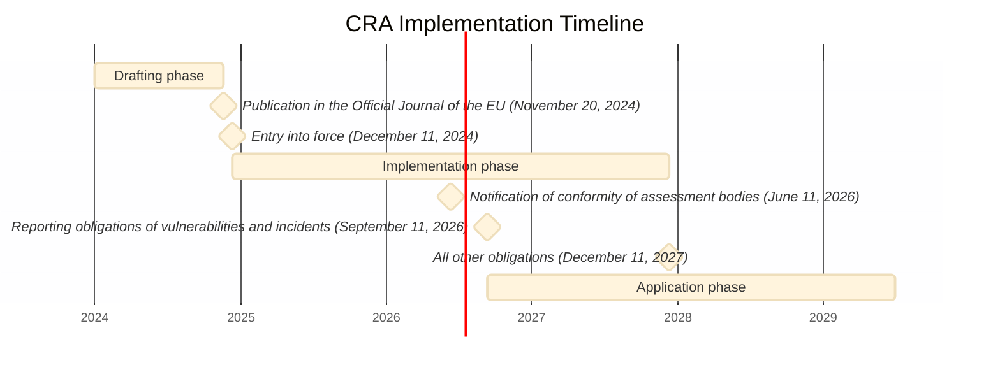

# When does the CRA enter into force and when does the regulation start to apply?

The Cyber Resilience Act (CRA) entered into force on December 11, 2024. Reporting obligations of actively exploited vulnerabilities and severe incidents ([[Article 14]]) start to apply on September 11, 2026.
All other obligations for software developers start to apply on December 11, 2027.

