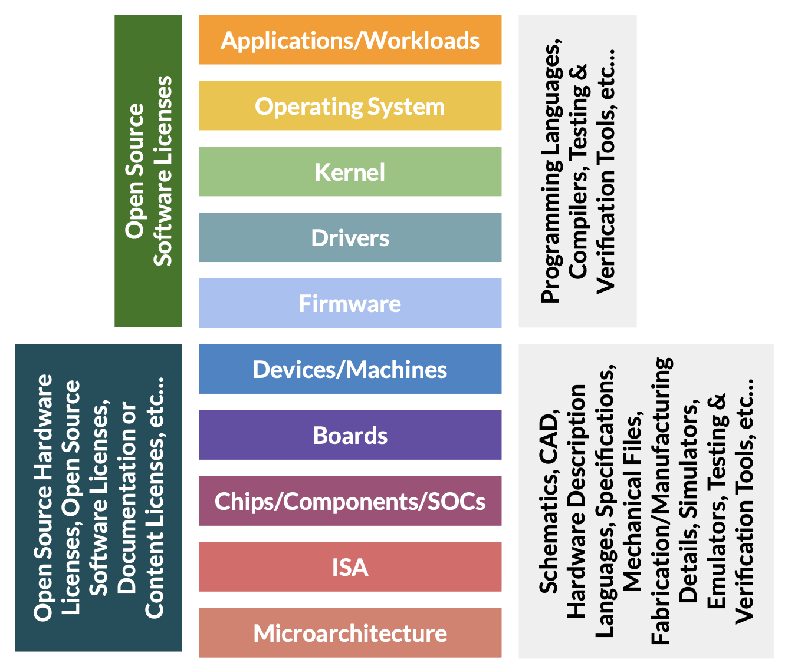

# Technical input to the Definitions of Critical and Important Products

## Status of this document

This document is work in progress. It is based on notes taken during the informal CRA Consultations organised by the European Commission in June and July 2024 and informal discussions between members of the Eclipse Foundations's Open Regulatory Compliance Working Group and OpenForum Europe's Open Source Task Force. It is provided for discussion only and may change at any moment. Its publication does not imply endorsement of its contents by the Eclipse Foundation or its Open Regulatory Compliance Working Group, nor by OpenForum Europe or its Open Source Task Force, nor by any of their members. Please do not cite this document other than as work in progress.

## Context

In June and July 2024, the European Commission ran a series of informal consultations to help define the Important and Critical products listed in [Annex III][] and [IV][Annex IV] of the Cyber Resilience Act (CRA). Important and Critical products are defined in [articles 7][Article 7] and [8][Article 8] of the CRA. (It is worth noting that important and critical products represent a subset of the products targeted by the CRA. Products with digital elements which aren't listed below are still subject to the CRA, they are just not categorised as important or critical.)

This document captures informal notes related to the definition of Important and Critical products and their related informal consultations.

It is separated in three parts:

1. [General considerations](#general-considerations)
2. [Software considerations](#software-considerations)
3. [Hardware considerations](#hardware-considerations)

## General considerations

1. A universal definition of each product category is very difficult. For each product category there are multiple definitions which would be valid. Clarity is important. When looking at the many valid answers we encourage the European Commission to give a preference to the definition which gives the most clarity.  If expert-time is required to decide which category regime to follow, then this adds to the compliance burden without contributing anything to the goals of the regulation. Effort put into compliance should be linked to advancing the regulation's goals. As a secondary criteria, we would suggest giving preference to narrower definitions, keeping in mind that products which don’t categorise as important or critical are still subject to the default horizontal regime. 
2. In defining the categories, the Commission should be wary of not accidentally including products which don’t, in practice, meet the criteria of [Article 7(2)(b)][Article 7] due to the ultimate use-case to be assessed on the basis of a comprehensive risk management process. 
3. The definitions need to respect the principle of proportionality regarding the risk involved with product usage. Defining abstract product categories without consideration for the inherent risk of the individual product risks overburdening certain products. For example, from a risk-based standpoint there is a difference whether a firewall product is used in a private household, in a company or as part of the infrastructure supporting a cloud service. The potential impact of a failure is completely different although it is the same product.
4. Predictability is key. Well defined definitions makes the CRA more predictable, where people can more easily understand what is part of what category. This is essential to quickly and effectively implement compliance across affected vendors as well as the drafting of related European harmonised standards and/or related fora/consortia open specifications.
5. Definitions should not discourage giving control to the end-user for decisions of intended purpose which could affect the product’s cybersecurity. These decisions are a mechanism for increasing cybersecurity and users making decisions is a crucial element of a well-functioning market.
6. Because these product categories imply having an increased regulatory burden, to minimise harm to European manufacturers they should not be excessively broad. Consistent with the new Commission mission letters, there should just as much chance a new product being added as product being removed or indeed the scope being defined more narrowly (for example focusing on more vanilla/consumer based products versus technology being co-developed and deployed in an industrial setting)
7. As the EU emerges as a world leader in digital technologies such as supercomputing and AI, open-source hardware components intended for integration by manufacturers into their hardware products with digital elements enable local innovation and academic research, and facilitate the production of these technologies within the EU. Open-source hardware offers unique opportunities for cybersecurity by ensuring hardware products can be verified against designs, and local production further increases the audit capabilities of the EU. The light-touch and tailor-made regulatory regime defined in the CRA for open-source software stewards was not extended to open-source hardware stewards, so the definitions and standards should exercise caution not to block the European market from the innovative and competitive advantages that open-source hardware can provide in support of technological sovereignty, local industry, and resilient supply chains. The definitions and standards for hardware-related product categories should also exercise caution not to block the usage of open-source software components within hardware products with digital elements.
8. In practice, from a software perspective, horizontal requirements should cover most product requirements, even in verticals. Indeed, a substantial number of products placed on the market, which might not be classified as important or critical, might include end-user facing software components, which themselves would not be classified as important or critical—or would be classified in a _different_ important or critical category—were they placed on the market individually. For example, consider a connected fridge with a screen providing end-user access to an operating system, a web browser, and a password manager.

## Software considerations

These software considerations aren't comprehensive. The choice of product categories addressed do not reflect anything other than the expertise and focus of the parties present. 

### Web browsers

As with most software product categories, most obligations that apply here come from horizontal risk.

### Operating systems

1. The Commission’s current approach must ensure legal clarity in the case of, say, an IoT and the base software on household appliances is clearly defined as “firmware” or some other term but not an “operating system”.
2. Definition should exclude components listed separately in the annex (e.g., browser is not a part of an operating system).
3. If the definition is not very narrow, operating system is going to end up including a lot of things, such as hypervisors, container runtimes, intrusion detection systems, and much much more, which makes little sense from a security perspective as they have different security challenges. Moreover, this worrying scenario of finger pointing within the supply chain will likely encourage those manufacturers (especially those who are necessarily contributing upstream) to try to shift the CRA requirements away from their specific product and upwards to those providing software components or products which constitute their end-article. Should this end user have significant market weight then it is sometimes the case that ‘pull through’ requests occur regardless of the legislation.
4. POSIX.1-2024 / IEEE Std 1003.1™-2024 - defines a standard operating system interface and environment, including a command interpreter (or "shell"), and common utility programs to support applications portability at the source code level. It is intended to be used by both application developers and system implementors.

### Hypervisors and container runtimes
1. Hypervisor and Containerization technology are converging. Containerization products are becoming hypervisor products and vice-versa.
2. The Commission’s implementation act must reflect technical realities by avoiding confusing established industry terms. For instance, “containers” in the context of the CRA means “container runtime” and should be defined accordingly with reference to existing specs.

## Hardware considerations

Standards that apply to hardware with digital elements shouldn’t preclude competition from open hardware.

Standards that apply to hardware with digital elements shouldn’t accidentally prevent usage of open source components within them.

As the EU emerges as a world leader in digital technologies such as supercomputing and AI, open-source hardware components intended for integration by manufacturers into their hardware products with digital elements enable local innovation and academic research, and facilitate the production of these technologies within the EU. Open-source hardware offers unique opportunities for cybersecurity by ensuring hardware products can be verified against designs, and local production further increases the audit capabilities of the EU. The light-touch and tailor-made regulatory regime defined in the CRA for open-source software stewards was not extended to open-source hardware stewards, so the definitions and standards should exercise caution not to block the European market from the innovative and competitive advantages that open-source hardware can provide in support of technological sovereignty, local industry, and resilient supply chains.

The definitions and standards for hardware-related product categories should also exercise caution not to block the usage of open-source software components within hardware products with digital elements.

### Additional background information on open hardware

> Open Source Hardware (OSHW) is a term for tangible artefacts — machines, devices, or other physical things — whose design has been released to the public in such a way that anyone can make, modify, distribute, and use those things.

— [Open Source Hardware (OSHW) Definition 1.0](https://www.oshwa.org/definition/)

(source: State of Open Con 2024, [opening keynote for Open Hardware track](https://www.lohutok.net/talks/soocon2024), by Allison Randal)

* Open Hardware is not a new idea, the [first Open Hardware Certificate Program was launched in 1997](https://www.oshwa.org/research/brief-history-of-open-source-hardware-organizations-and-definitions/).
* Open Hardware often uses different licences than open source software, but the licences grant the same rights to use, study, modify, and share the hardware designs and specifications.
* For open hardware, the “source” that’s distributed takes different forms. Some open hardware sources are very similar to software, such as Hardware Description Languages which are sometimes even modified versions of software programming languages (for example, the [Chisel](https://www.chisel-lang.org/) HDL is basically just the [Scala](https://www.scala-lang.org/) programming language with some domain-specific extensions). Some open hardware sources are completely unlike software, because they are providing the information necessary to construct physical devices, such as board schematics, CAD files, manufacturing or fabrication details, etc.
* The tools required to build, test, and verify open hardware are completely different than the tools used with open source software. For open source software, most of the tools are open, but for open hardware most of the tools are proprietary (though in recent years, more open hardware tools are being released as open source).

There are multiple layers of open hardware that build on each other.

* The highest level is open hardware devices or boards, which provide all the information necessary to manufacture a device based on open designs. These devices or boards may use proprietary components, as long as those components are “available” (i.e. a person or company could reasonably purchase the components necessary to assemble the device/board). Some examples at this level of open hardware are the original Open Hardware Certificate Program, the [Open Source Hardware Association’s certificate program](https://certification.oshwa.org/), [CERN’s Open Hardware licences](https://cern-ohl.web.cern.ch/home), the [Open Compute Project](https://www.opencompute.org/) (open high-performance server designs), [Open Science Hardware Foundation](https://opensciencehardware.org/), [Libre Space Foundation](https://libre.space/), [Arduino](https://www.arduino.cc/en/hardware).
* The next level down is “Open Silicon” where the designs for the chips, SOCs, or other low-level components are released under an open licence. These may require proprietary tools or a proprietary manufacturing process to render the designs as a physical product, but all the information necessary to use, study, modify, and share the “source code” for the chips is open. Some examples at this level of hardware are the [OpenHW Group](https://www.openhwgroup.org/), [CHIPS Alliance](https://www.chipsalliance.org/), [Free Silicon Foundation](https://wiki.f-si.org), [Free and Open Source Silicon Foundation](https://fossi-foundation.org/).
* Related to open hardware are “Open Specifications” like the RISC-V instruction set architecture, which define an interface and standard behaviours of the hardware, but don’t actually provide “source code” for the chips/components to be rendered as physical products. The RISC-V specification **is not open hardware**, though the openly licensed nature of the specifications may require some consideration for CRA product categories. And, some specific implementations of RISC-V, such as the [OpenHW Group’s RISC-V cores](https://github.com/openhwgroup/core-v-cores), ETH Zurich’s Ariane/CVA6 core and [Pulp SOC](https://www.pulp-platform.org/implementation.html), or University of Berkeley’s [Rocket core](https://github.com/chipsalliance/rocket-chip) and [BOOM cores](https://docs.boom-core.org/en/latest/sections/intro-overview/boom.html), release all the source code for the chips under an open license, and so are truly open hardware/open silicon.

### A few Open Hardware examples in different hardware-related product categories

* Physical and virtual network interfaces
    * O-RAN Alliance e.V. <https://specifications.o-ran.org/specifications> 
    * WiFiBee <https://github.com/watterott/WiFi-Bee>
* Routers, modems intended for the connection to the internet, and switches
    * LibreRouter <https://gitlab.com/librerouter/boards>
* Microprocessors with security-related functionalities
    * CHERI <https://www.cl.cam.ac.uk/research/security/ctsrd/cheri/>
* Microcontrollers with security-related functionalities
    * OpenTitan <https://opentitan.org/>
* Smart home general purpose virtual assistants
    * Satellite1 voice assistant <https://github.com/FutureProofHomes/Satellite1-Hardware>
* Personal wearable products to be worn or placed on a human body that have a health monitoring (such as tracking) purpose and to which Regulation (EU) 2017/745 or Regulation (EU) 2017/746 do not apply or personal wearable products that are intended for the use by and for children
    * Herald <https://github.com/theheraldproject/herald-hardware> 
* Smartcards or similar devices, including secure elements
    * Nitrokey <https://www.nitrokey.com/products/nitrokeys>

[Article 7]: https://eur-lex.europa.eu/legal-content/EN/TXT/HTML/?uri=OJ:L_202402847#art_7
[Article 8]: https://eur-lex.europa.eu/legal-content/EN/TXT/HTML/?uri=OJ:L_202402847#art_8
[Annex III]: https://eur-lex.europa.eu/legal-content/EN/TXT/HTML/?uri=OJ:L_202402847#anx_III
[Annex IV]: https://eur-lex.europa.eu/legal-content/EN/TXT/HTML/?uri=OJ:L_202402847#anx_IV

